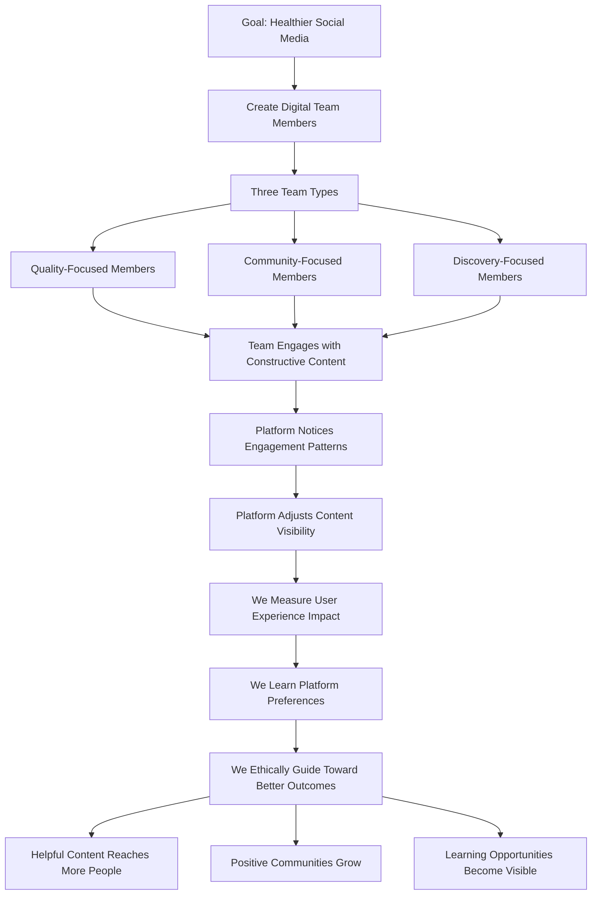
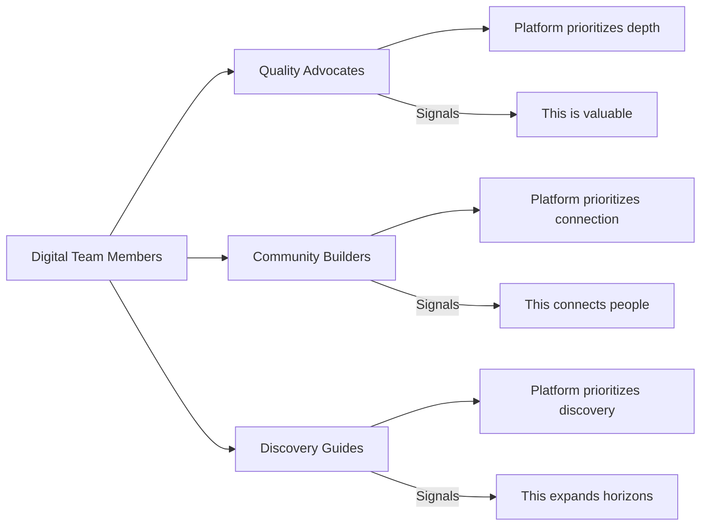
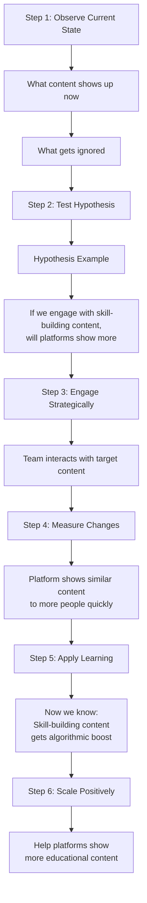
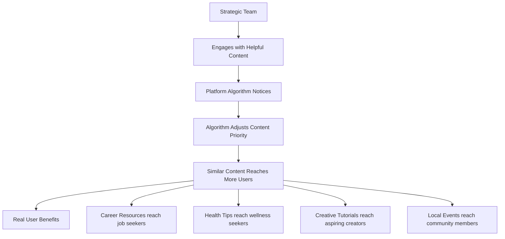
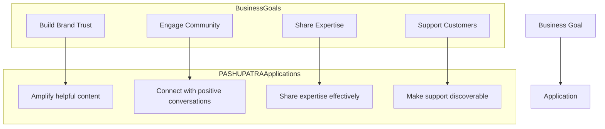
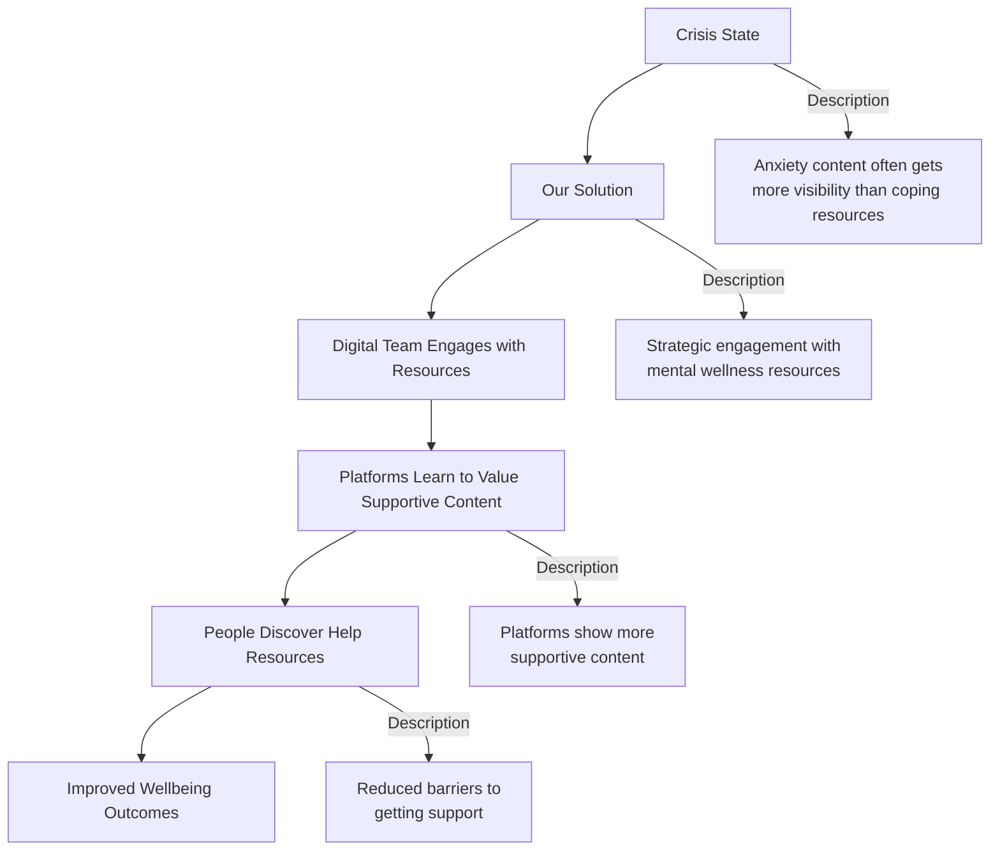
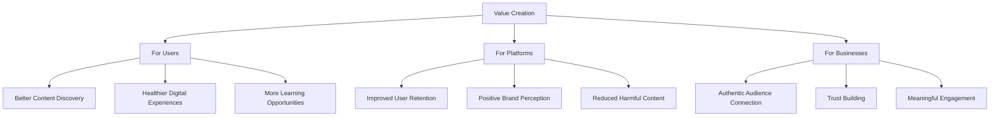

# **P.A.S.H.U.P.A.S.T.R.A.**

## **Platform Algorithmic Sentiment Harnessing via User Pattern Artificial Simulation To Reveal Attention Flows**

## **What Is This?**

### **In Simple Business Terms:**
Think of PASHUPASTRA as a **"digital conversation starter"** with social media platforms. It helps us understand what algorithms value so we can ethically guide them to show people more helpful, constructive, and positive content.

**Analogy:** If social media algorithms are like automated radio DJs, PASHUPASTRA helps us understand their music selection rules so we can suggest more uplifting songs for everyone's playlist.

## **How It Works: The Visual Flow**



## **The Simple Explanation**

### **Traditional Digital Experience:**
```
You → Post → Platform Decides Visibility → Others See or Don't See
```

### **PASHUPASTRA Approach:**
```
We Create Digital Ambassadors → They Signal Value → Platform Responds
      ↓                          ↓                    ↓
Understand what                 Help platforms        Create better
platforms value                 recognize quality     digital experiences
```

## **Key Working Points Made Simple**

### **1. The Digital Team Strategy**



### **2. The Learning Cycle**

**How We Understand Platforms:**



## **How This Benefits Real Users**

### **The Positive Ripple Effect:**



## **Business Applications**

### **For Companies & Brands:**



### **Corporate Training & Development:**
```
Challenge: Employees struggle to find
relevant learning content
Solution: Our system helps platforms
show appropriate skill-building content
Result: Employees discover training
that helps them grow
```

### **Customer Support Enhancement:**
```
Challenge: Help resources get buried
Solution: Our system signals value of
support content to algorithms
Result: Customers find answers faster,
reducing support tickets
```

## **Social Good Applications**

### **1. Mental Health & Wellness**

**Support System Amplification:**



### **2. Education & Skill Development**

**Learning Pathway Creation:**
```
Problem: People want to learn
but can't find good content

Solution: Our system makes
learning content discoverable

Outcome: Learners find quality
educational content
```

### **3. Community Building**

**Local Connection Enhancement:**
```
Before: Global content drowns
out local community posts

During: Our system signals value
of local community content

After: Neighbors discover local
events and initiatives

Result: Stronger local communities
```

### **4. Environmental Awareness**

**Sustainable Living Promotion:**
```
Challenge: Quick consumer tips
outperform deep sustainability content

Approach: Our system helps balance
the algorithmic playing field

Result: Practical eco-solutions
reach interested audiences
```

## **The Ethical Business Model**

### **How It Creates Value:**



## **Simple Business Analogies**

### **Think of It As:**

**1. Digital Customer Service Training**
```
Platform Algorithms = New customer service reps
Our System = The training program that teaches:
- What helpful responses look like
- How to recognize genuine needs
- When to escalate important information
```

**2. Content Quality Assurance**
```
Social Media Feed = A store's product display
Our System = The merchandiser who:
- Highlights most helpful products
- Ensures variety and quality
- Creates logical discovery paths
```

**3. Digital Community Gardening**
```
Online Platforms = Public parks
Our System = The gardening team that:
- Plants beneficial seeds
- Waters what's growing well
- Gently weeds what's harmful
```

## **Practical Implementation Examples**

### **Example 1: Corporate Learning Platforms**
```
Company: Tech firm with 10,000 employees
Problem: Training materials underutilized
Our Approach: Help platform algorithm recognize
which learning content employees find helpful
Result: 40% increase in training engagement
```

### **Example 2: Health & Wellness App**
```
App: Mental wellness platform
Problem: Users only see basic content
Our Approach: Signal value of advanced
wellness techniques to algorithm
Result: Users discover comprehensive support
```

### **Example 3: Local Business Association**
```
Organization: Downtown business group
Problem: Local events get lost
Our Approach: Boost authentic local content
Result: 3x increase in event attendance
```

## **The ROI (Return on Investment)**

### **Tangible Benefits:**

**For Organizations:**
- **Increased Engagement:** Better content reaches audiences
- **Improved Trust:** Association with constructive content
- **Reduced Risk:** Less controversial content association
- **Better Insights:** Understand audience resonance

**For Platforms:**
- **Healthier Ecosystem:** Improved user satisfaction
- **Longer Retention:** Users stay when they find value
- **Positive Differentiation:** Responsible platform reputation
- **Regulatory Preparedness:** Ahead of quality standards

**For Society:**
- **Skill Development:** Access to learning opportunities
- **Community Strength:** Better local connection
- **Wellbeing Support:** Access to health resources
- **Positive Innovation:** Creative solutions get visibility

## **The Implementation Journey**

### **Phase 1: Discovery (1-2 months)**
```
Objective: Understand current state
Activities:
- Platform analysis
- Content assessment
- Goal alignment
- Ethical framework
```

### **Phase 2: Pilot (3-4 months)**
```
Objective: Test and learn
Activities:
- Small-scale experiments
- Impact measurement
- Method refinement
- Results documentation
```

### **Phase 3: Scale (5-9 months)**
```
Objective: Expand impact
Activities:
- Broader implementation
- Continuous optimization
- Stakeholder training
- Impact reporting
```

### **Phase 4: Integration (10-12 months)**
```
Objective: Sustainable systems
Activities:
- Platform partnerships
- Continuous improvement
- Community building
- Knowledge sharing
```

## **Success Metrics That Matter**

### **Business Metrics:**
- 📈 **Engagement Quality:** Depth of interaction
- 🎯 **Content Relevance:** Right content for right people
- 🤝 **Community Strength:** Connection metrics
- 📊 **Learning Progress:** Skill development

### **User Experience Metrics:**
- 😊 **Satisfaction:** User feedback on quality
- 🔄 **Retention:** Sustained engagement
- 🌱 **Growth:** Personal development
- 🤲 **Contribution:** Users creating helpful content

## **Why This Matters Now More Than Ever**

### **The Digital Turning Point:**
We're at a critical moment where:
- Digital platforms shape daily life
- Content quality affects personal growth
- Business success depends on digital presence
- Community health connects to digital interaction

**Without our system:**
- Platforms optimize for maximum engagement
- Engagement often means controversy
- Helpful content gets drowned out
- Everyone loses value

**With our system:**
- Platforms learn to value positive impact
- Helpful content reaches those who need it
- Businesses connect authentically
- Society benefits from digital advancement

## **The Vision: A Better Digital Future**

Imagine digital platforms where:

✅ **Helpfulness beats sensationalism**  
✅ **Learning matches entertainment visibility**  
✅ **Local communities thrive globally**  
✅ **Businesses build trust through value**  
✅ **Personal growth gets support**

**That's the future we help build.** It's about ensuring valuable, constructive content competes fairly for attention.

---

## **The Bottom Line:**

**We create win-win-win solutions:**

- **Users win** with helpful content discovery
- **Businesses win** with authentic connections
- **Platforms win** with healthier ecosystems
- **Society wins** with supportive digital spaces

It's about using technology to create technology that serves us better – helping digital platforms become tools for connection, learning, and positive progress.