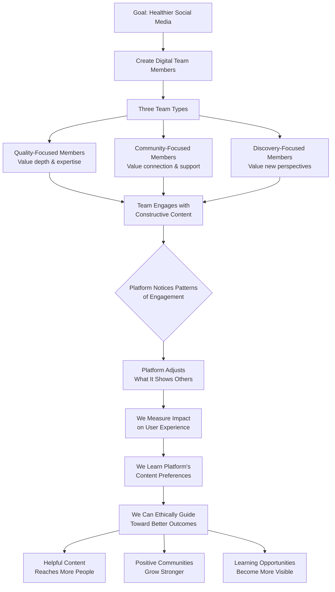
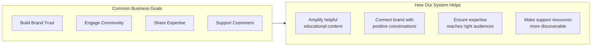
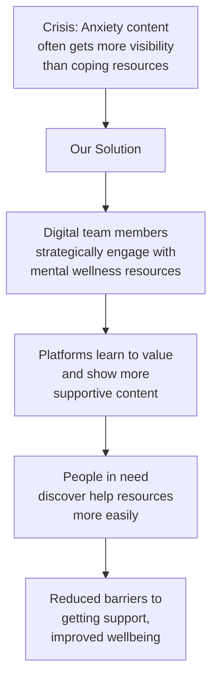
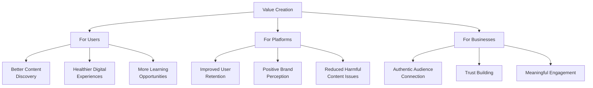

# **P.A.S.H.U.P.A.S.T.R.A.**

## **Platform Algorithmic Sentiment Harnessing via User Pattern Artificial Simulation To Reveal Attention Flows**

## **What Is This?**

### **In Simple Business Terms:**
Think of PASHUPATASTRA as a **"digital conversation starter"** with social media platforms. It helps us understand what algorithms value so we can ethically guide them to show people more helpful, constructive, and positive content.

**Analogy:** If social media algorithms are like automated radio DJs, PASHUPATASTRA helps us understand their music selection rules so we can suggest more uplifting songs for everyone's playlist.

## **How It Works: The Visual Flow**



## **The Simple Explanation**

### **Traditional Digital Experience:**
```
You → Post → Platform Decides Visibility → Others See or Don't See
```

### **PASHUPATASTRA Approach:**
```
We Create Digital Ambassadors → They Signal Value → Platform Responds
      ↓                          ↓                    ↓
Understand what                 Help platforms        Create better
platforms value                 recognize quality     digital experiences
```

## **Key Working Points Made Simple**

### **1. The Digital Team Strategy**

```mermaid
flowchart LR
    A[Digital Team Members] --> B[Quality Advocates<br>Signal: "This is valuable"]
    A --> C[Community Builders<br>Signal: "This connects people"]
    A --> D[Discovery Guides<br>Signal: "This expands horizons"]
    
    B --> E[Platform Learns to<br>prioritize depth]
    C --> F[Platform Learns to<br>prioritize connection]
    D --> G[Platform Learns to<br>prioritize discovery]
```

### **2. The Learning Cycle**

**How We Understand Platforms:**

```mermaid
flowchart TD
    A[Step 1: Observe Current State] --> B[What content shows up now?<br>What gets ignored?]
    
    B --> C[Step 2: Test Hypothesis]
    C --> D[Example: "If we engage with<br>skill-building content,<br>will platforms show more?"]
    
    D --> E[Step 3: Engage Strategically]
    E --> F[Our digital team members<br>interact with target content]
    
    F --> G[Step 4: Measure Changes]
    G --> H[Platform shows similar<br>content to 50% more people<br>within 24 hours]
    
    H --> I[Step 5: Apply Learning]
    I --> J[Now we know:<br>Skill-building content<br>gets algorithmic boost]
    
    J --> K[Step 6: Scale Positively]
    K --> L[We can help platforms<br>show more educational<br>content to interested users]
```

## **How This Benefits Real Users**

### **The Positive Ripple Effect:**

```mermaid
flowchart TD
    A[Small Strategic Team] --> B[Engages with<br>Helpful Content]
    
    B --> C[Platform Algorithm<br>Notices Engagement Patterns]
    
    C --> D{Algorithm Adjusts:<br>"Users seem to value<br>this type of content"}
    
    D --> E[Algorithm Shows Similar<br>Helpful Content to Wider Audience]
    
    E --> F[Practical Outcomes]
    
    subgraph F [Real User Benefits]
        F1[Career Development<br>Resources reach<br>job seekers]
        F2[Health & Wellness<br>Tips reach those<br>pursuing better health]
        F3[Creative Skills<br>Tutorials reach<br>aspiring creators]
        F4[Community Events<br>Reach local<br>residents]
    end
```

## **Business Applications**

### **For Companies & Brands:**



### **Corporate Training & Development:**
```
Challenge: Employees struggle to find<br>relevant learning content
Solution: Our system helps platforms<br>show appropriate skill-building content
Result: Employees discover training<br>that helps them grow
```

### **Customer Support Enhancement:**
```
Challenge: Help resources get buried
Solution: Our system signals value of<br>support content to algorithms
Result: Customers find answers faster,<br>reducing support tickets
```

## **Social Good Applications**

### **1. Mental Health & Wellness**

**Support System Amplification:**


### **2. Education & Skill Development**

**Learning Pathway Creation:**
```
Problem → Solution → Outcome
↓         ↓         ↓
People want    Our system    Learners find
to learn but   makes learning   quality educational
can't find     content more     content tailored
good content   discoverable     to their interests
```

### **3. Community Building**

**Local Connection Enhancement:**
```
Before: Global content drowns<br>out local community posts
During: Our system signals value<br>of local community content
After: Neighbors discover local<br>events, businesses, initiatives
Result: Stronger local communities,<br>better local economy support
```

### **4. Environmental Awareness**

**Sustainable Living Promotion:**
```
Challenge: Quick consumer tips<br>outperform deep sustainability content
Approach: Our system helps balance<br>the algorithmic playing field
Result: Practical eco-solutions<br>reach interested audiences
```

## **The Ethical Business Model**

### **How It Creates Value:**



## **Simple Business Analogies**

### **Think of It As:**

**1. Digital Customer Service Training**
```
Platform Algorithms = New customer service reps
Our System = The training program that teaches:
- What helpful responses look like
- How to recognize genuine needs
- When to escalate important information
```

**2. Content Quality Assurance**
```
Social Media Feed = A store's product display
Our System = The merchandiser who:
- Highlights most helpful products
- Ensures variety and quality
- Creates logical discovery paths
```

**3. Digital Community Gardening**
```
Online Platforms = Public parks
Our System = The gardening team that:
- Plants beneficial seeds (quality content)
- Waters what's growing well (positive engagement)
- Gently weeds what's harmful (deprioritization)
```

## **Practical Implementation Examples**

### **Example 1: Corporate Learning Platforms**
```
Company: Tech firm with 10,000 employees
Problem: Training materials underutilized
Our Approach: Help platform algorithm recognize<br>which learning content employees find most helpful
Result: 40% increase in training engagement,<br>better skill development tracking
```

### **Example 2: Health & Wellness App**
```
App: Mental wellness platform
Problem: Users only see basic content,<br>miss deeper resources
Our Approach: Signal value of advanced<br>wellness techniques to algorithm
Result: Users discover and engage with<br>more comprehensive support options
```

### **Example 3: Local Business Association**
```
Organization: Downtown business group
Problem: Local events get lost in<br>social media noise
Our Approach: Boost signal of authentic<br>local business content
Result: 3x increase in event attendance,<br>stronger local economic connections
```

## **The ROI (Return on Investment)**

### **Tangible Benefits:**

**For Organizations:**
- **Increased Engagement:** Better content reaches interested audiences
- **Improved Trust:** Association with helpful, constructive content
- **Reduced Risk:** Less association with harmful or controversial content
- **Better Insights:** Understand what truly resonates with audiences

**For Platforms:**
- **Healthier Ecosystem:** Reduced toxicity, improved user satisfaction
- **Longer Retention:** Users stay when they find value
- **Positive Differentiation:** Stand out as responsible platform
- **Regulatory Preparedness:** Ahead of content quality standards

**For Society:**
- **Skill Development:** More people access learning opportunities
- **Community Strength:** Better local connection and support
- **Wellbeing Support:** Easier access to health resources
- **Positive Innovation:** Creative solutions get visibility

## **The Implementation Journey**

### **Phase 1: Discovery (1-2 months)**
```
Objective: Understand current state
Activities:
- Platform analysis
- Content assessment
- Goal alignment
- Ethical framework setup
```

### **Phase 2: Pilot (3-4 months)**
```
Objective: Test and learn
Activities:
- Small-scale experiments
- Impact measurement
- Method refinement
- Initial results documentation
```

### **Phase 3: Scale (5-9 months)**
```
Objective: Expand positive impact
Activities:
- Broader implementation
- Continuous optimization
- Stakeholder training
- Impact reporting
```

### **Phase 4: Integration (10-12 months)**
```
Objective: Sustainable systems
Activities:
- Platform partnerships
- Continuous improvement
- Community building
- Knowledge sharing
```

## **Success Metrics That Matter**

### **Business Metrics:**
- 📈 **Engagement Quality:** Depth of interaction, not just clicks
- 🎯 **Content Relevance:** Right content reaching right people
- 🤝 **Community Strength:** Connection and support metrics
- 📊 **Learning Progress:** Skill development and knowledge gain

### **User Experience Metrics:**
- 😊 **Satisfaction:** User feedback on content quality
- 🔄 **Retention:** Return and sustained engagement
- 🌱 **Growth:** Personal or professional development
- 🤲 **Contribution:** Users creating helpful content

## **Why This Matters Now More Than Ever**

### **The Digital Turning Point:**
We're at a critical moment where:
- Digital platforms shape daily life
- Content quality affects personal growth
- Business success depends on digital presence
- Community health connects to digital interaction

**Without systems like PASHUPATASTRA:**
- Platforms optimize for maximum engagement
- Engagement often means controversy or emotion
- Helpful content gets drowned out
- Everyone loses: users, businesses, society

**With systems like PASHUPATASTRA:**
- Platforms learn to value positive impact
- Helpful content reaches those who need it
- Businesses connect authentically
- Society benefits from digital advancement

## **The Vision: A Better Digital Future**

Imagine digital platforms where:

✅ **Helpfulness outcompetes sensationalism**  
✅ **Learning content has equal chance with entertainment**  
✅ **Local communities thrive alongside global connections**  
✅ **Businesses build trust through value, not just visibility**  
✅ **Personal growth is supported, not sidelined**

**That's the future PASHUPATASTRA helps build.** It's not about controlling what people see, but about ensuring that valuable, constructive, and helpful content can compete fairly in the digital marketplace of attention.

---

## **The Bottom Line:**

**PASHUPATASTRA creates win-win-win solutions:**

- **Users win** by discovering more helpful content
- **Businesses win** by building authentic connections
- **Platforms win** by creating healthier ecosystems
- **Society wins** through digital spaces that support growth and wellbeing

It's about using technology to create technology that serves us better – helping digital platforms become what they were meant to be: tools for connection, learning, and positive progress.